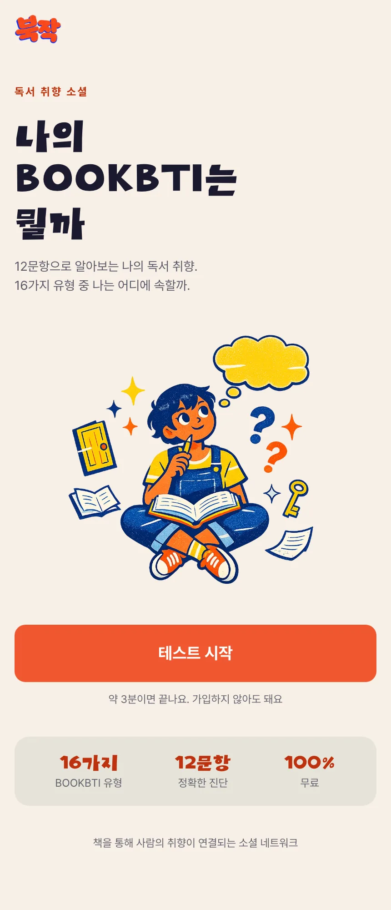
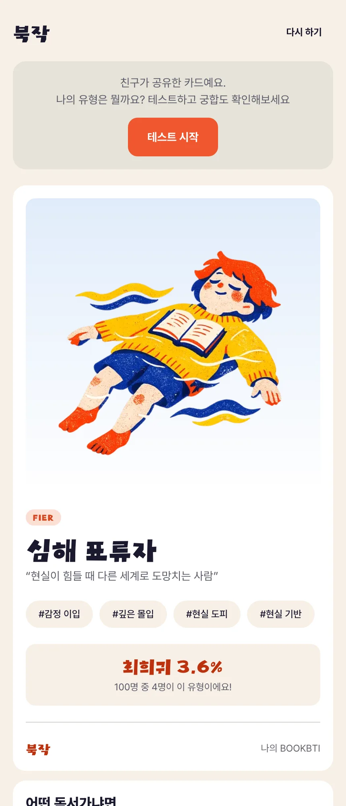
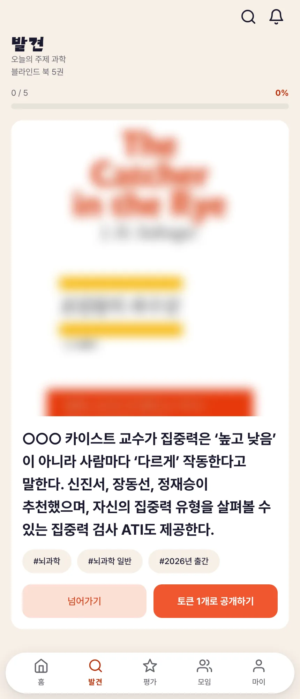
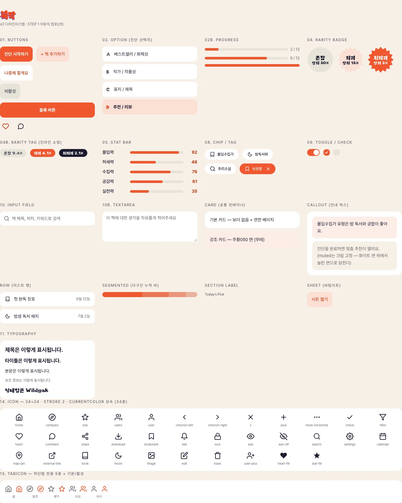

# 북작 (BOOKJAK)

> 취향으로 북적이는 독서 취향 소셜 서비스

책을 "얼마나 많이 읽었는가"가 아니라 "어떤 취향으로 읽는가"를 중심에 둔 독서 소셜 플랫폼입니다.
16가지 독서 유형 테스트로 자신의 독서 취향을 진단하고, 취향이 맞는 사람과 책 모임을 통해 연결됩니다.

**라이브** · https://book-jak.vercel.app　|　**디자인 시스템** · https://book-jak.vercel.app/design-system　|　**Figma** · [북작_v2](https://www.figma.com/design/o9cV3nPv5FfOHYl9L7DGSF/%EB%B6%81%EC%9E%91_v2?node-id=4-5)

| 유형 테스트 | 결과 카드 | 블라인드 북 |
|---|---|---|
|  |  |  |

> 둘러보기는 로그인 없이 됩니다. 테스트·결과·블라인드 북·책 검색은 비로그인으로 볼 수 있고, 글쓰기·평가 저장 같은 쓰기 동작만 카카오 로그인을 요구합니다.

## 주요 기능

### BOOKBTI 독서 유형 테스트
- 12문항, 4개 축 조합으로 16가지 독서 유형 산출. 희소도는 2025 국민독서실태조사 응답 비율로 산정
- 유형별 능력치·궁합·생각 말풍선, 결과 카드 이미지 저장(`html-to-image`)
- 유형별 OG 이미지(`next/og`)와 궁합 초대 링크 — 친구가 링크로 테스트를 끝내면 궁합 비교로 이어짐

### 블라인드 북
- 알라딘 베스트셀러·신간에서 KST 날짜별로 모든 사용자에게 같은 5권, 요일별 테마
- 소개 문장에서 제목·저자·다른 작품명을 가려 1~2문장만 노출
- 공개에 토큰 1개(출석·글·댓글로 적립). 지급·차감은 DB 함수가 원자적으로 처리

### 평가 · 취향 리포트
- 알라딘 검색으로 책 찾기, 0.5점 단위 별점·리뷰, 위시리스트
- 취향 리포트: 4축 스펙트럼, 장르 비율, 별점 성향, 인생책 3권, 배지 44종(흔함·희귀·최희귀)

### 소셜
- 홈 피드(글·댓글·좋아요·Hot), 팔로우, 알림(내 소식 / 팔로잉 활동)
- 책 모임(게시판·궁금한 점 스레드·관심 모임), 책 추천(추천받기 / 추천하기)
- 유형 궁합과 같이 높게 준 책으로 취향 비슷한 사람 찾기, 랭킹
- 신고·차단, 탈퇴 시 글은 남기고 개인정보만 파기(익명화)

## 기술 스택

| 영역 | 기술 |
|---|---|
| 프레임워크 | Next.js 16 (App Router), React 19, TypeScript |
| 상태관리 | Zustand (전역 상태 필요 시) + localStorage 기반 순수 함수 패턴 (단순 저장/조회) |
| 백엔드 / 인증 | Supabase (Auth, DB) — 카카오 OAuth 연동 |
| 외부 API | 알라딘 도서 API (서버 라우트에서 프록시, TTBKey 서버측 은닉) |
| 이미지 생성 | html-to-image (결과 카드 저장), next/og (유형별 OG 이미지) |
| 테스트 · CI | Vitest, GitHub Actions (lint → typecheck → test) |
| 배포 · 관측 | Vercel, Vercel Analytics · Speed Insights |
| 아키텍처 | FSD(Feature-Sliced Design) 변형 — `app / views / widgets / features / entities / shared` |

### 아키텍처 특징

FSD를 기준으로 하되 Next.js App Router에 맞게 바꿨습니다. 규칙 전문은 [`docs/ARCHITECTURE.md`](./docs/ARCHITECTURE.md)에 있습니다.

- **`views` 레이어 추가** — App Router는 `app/` 아래 파일 위치가 곧 URL이라, 화면 코드를 거기 두면 라우트를 옮길 때 화면 코드도 같이 흔들립니다. 그래서 `app/*/page.tsx`는 `views/*/ui/*View.tsx`를 렌더링만 하고(약관 등 정적 페이지 제외), 화면 로직은 `views`에 둡니다. 폴더명은 라우트 경로를 kebab-case로 평탄화합니다 (`/social/clubs/[id]` → `views/social-club-detail`).
- **`entities` 서브폴더는 필요한 것만** — `ui`/`model`/`api` 3종을 기계적으로 만들지 않습니다 (예: `external-book`은 `model`만, `club`은 `api`·`model`·`ui`). 빈 폴더는 구조를 설명하지 않고 노이즈만 됩니다.
- **`shared` 승격은 두 번째 사용처가 생길 때** — "지금 두 곳 이상에서 쓰이는가"가 기준입니다. 미리 공통화하면 한 곳만 바뀌어야 할 때 다른 곳까지 깨지기 때문입니다.
- Supabase 클라이언트를 용도별(브라우저: 클라이언트 컴포넌트 / 서버: 서버 컴포넌트·라우트 핸들러)로 분리해 클라이언트-서버 경계를 명확히 관리

## 실행 방법

### 요구사항
- Node.js 20 이상
- pnpm
- Supabase 프로젝트 (Auth + DB)
- 알라딘 TTBKey (도서 데이터용)

### 설치

```bash
git clone https://github.com/jjipper/book-jak.git
cd book-jak
pnpm install
```

### 환경변수 설정

```bash
cp .env.example .env.local
```

| 키 | 필수 | 설명 |
|---|---|---|
| `NEXT_PUBLIC_SUPABASE_URL` | O | Supabase 프로젝트 URL |
| `NEXT_PUBLIC_SUPABASE_ANON_KEY` | O | Supabase anon key |
| `ALADDIN_TTB_KEY` | O | [알라딘 TTBKey](https://www.aladin.co.kr/ttb/wapui/wapi_guide.aspx) — 책 목록·검색·상세 (서버 전용) |
| `SUPABASE_DB_URL` | | DB 접속 URI — 마이그레이션 실행 시 |
| `NEXT_PUBLIC_SITE_URL` | | 배포 도메인 — OG·sitemap 절대 URL 기준 |

### 개발 서버 실행

```bash
pnpm dev
```

브라우저에서 [http://localhost:3000](http://localhost:3000) 접속

### 기타 명령어

```bash
pnpm build                  # 프로덕션 빌드
pnpm start                  # 프로덕션 서버 실행
pnpm lint                   # ESLint 검사
pnpm typecheck              # 타입 검사 (tsc --noEmit)
pnpm test                   # 단위 테스트 (Vitest)
pnpm rls:check              # RLS 점검 — 가상 사용자로 남의 데이터 접근 시도 후 롤백
node scripts/migrate.mjs    # supabase/migrations 중 미적용분 실행
```

## 디자인 시스템

[`/design-system`](https://book-jak.vercel.app/design-system)에서 공용 컴포넌트 갤러리를 볼 수 있습니다. 전체 규칙은 [`docs/DESIGN.md`](./docs/DESIGN.md)에 있습니다.



[Figma](https://www.figma.com/design/o9cV3nPv5FfOHYl9L7DGSF/%EB%B6%81%EC%9E%91_v2?node-id=4-5)에서 먼저 설계하고 코드로 옮겼습니다. 파일은 Foundations(색·타이포·효과 스타일) / Components(7개 카테고리, 배리언트·스펙 노트) / Screens(화면 12개를 컴포넌트로) / Flow(화면 인스턴스로 구성한 사용자 흐름 3개 레인)로 나눴습니다. 화면을 컴포넌트로 만들어 두어 시안을 고치면 Flow 다이어그램도 함께 바뀝니다. Figma 효과 스타일 수치는 SVG 내보내기에서 뽑아 `--elevation-floating` 같은 토큰으로 옮겼습니다.

### 핵심 규칙
- **UI 강조는 주황 하나.** 버튼·활성·뱃지 모두 `--color-accent`만 씁니다. 형광색은 일러스트에만 씁니다.
- **테두리 없이 면 색으로 위계.** 크림(페이지) / 화이트(카드) / 잉크(텍스트)로 구분합니다. 그림자는 스크롤 콘텐츠 위에 뜨는 하단탭·FAB에만 예외로 씁니다.
- **컨트롤 면은 상속으로 자동 대비.** 칩·인풋은 `--color-control-surface`를 쓰고, 화이트 카드 안에서는 이 토큰이 크림으로 바뀝니다. 호출부가 배경을 신경 쓰지 않아도 됩니다.
- **컴포넌트는 의미 토큰만 참조.** `#hex`나 원시 토큰(`--p-*`)을 직접 쓰지 않습니다.

### 참조 구조

```
src/shared/styles/tokens.css       primitive  --p-orange-500 …
                                       ↓
                                   semantic   --color-accent, --color-control-surface …
src/shared/styles/components.css   .bj-btn, .bj-card, .bj-chip …   (semantic 토큰만 사용)
                                       ↓
src/shared/ui/*.tsx                Button → .bj-btn--primary …
                                       ↓
src/views/*/ui/*View.tsx           화면 (화면 전용 CSS는 같은 폴더의 *.css)
```

## 품질 · 보안 · 성능

문제 해결 과정은 [`docs/TROUBLESHOOTING.md`](./docs/TROUBLESHOOTING.md)에 배경 → 판단 → 실행 → 결과로 정리했습니다.

- **테스트** — 유형 채점·궁합·배지 판정·블라인드 북 가림/일별 선정·상대 시간 등 도메인 순수 함수를 Vitest로 검증하고, CI에서 lint·typecheck와 함께 돌립니다.
- **권한은 DB가 보장** — 모든 테이블에 RLS를 적용했습니다. 카운트·토큰처럼 조작되면 안 되는 값은 클라이언트가 아니라 트리거·DB 함수만 바꿉니다. `pnpm rls:check`로 남의 글 수정·사칭·집계 조작·토큰 직접 지급 등을 시도해 막히는지 확인합니다.
- **외부 API 키 은닉** — 알라딘 TTBKey는 서버 라우트에서만 쓰고, 일 호출 한도를 고려해 응답을 서버에서 캐시합니다.
- **성능** — 정적 이미지 164MB → 4.5MB(WebP·표시 크기 맞춤), 폰트 렌더 차단 제거, LCP 이미지 우선 로드.
- **접근성** — 작은 글자는 WCAG AA 대비(4.5:1)를 맞춘 토큰(`--color-accent-text`)을 따로 둡니다.

Lighthouse 모바일 기준이며, 배포본에서 개선 전 1회, 개선 후 3회를 측정해 중앙값을 적었습니다.

| 페이지 | 성능 점수 | LCP | 전송량 |
|---|---|---|---|
| 홈 | 65 → 78 | 9.7s → 5.7s | 2,299KB → 788KB |
| 테스트 | 71 → 77 | 9.0s → 5.1s | 2,516KB → 898KB |
| 블라인드 북 | 73 → 79 | 6.2s → 5.0s | 1,141KB → 763KB |

## AI 협업 워크플로우

Claude Code로 개발하면서, AI가 매번 같은 판단을 하도록 규칙을 문서로 고정했습니다. [`CLAUDE.md`](./CLAUDE.md)를 진입점으로 두고, 상세 규칙은 역할별 문서로 나눴습니다.

| 문서 | 역할 |
|---|---|
| [`CLAUDE.md`](./CLAUDE.md) | 진입점 — 문서 안내, 커밋 규칙, Supabase 클라이언트 구분, 상태 관리 기준, 네이밍 |
| [`docs/PRD.md`](./docs/PRD.md) | 제품 사양 |
| [`docs/DESIGN.md`](./docs/DESIGN.md) | 디자인 규칙 — 토큰, 면 위계, 로딩·에러·긴 텍스트 처리 |
| [`docs/ARCHITECTURE.md`](./docs/ARCHITECTURE.md) | 폴더 구조와 배치 기준 |
| [`docs/ai/BADGE_IMAGEGEN.md`](./docs/ai/BADGE_IMAGEGEN.md) | 배지 44종 이미지 생성 — 프롬프트 구조와 자동 검증 기준 |
| [`AGENTS.md`](./AGENTS.md) | Next.js 16 버전별 주의사항 (도구 자동 생성) |

대표 규칙:
- **컴포넌트를 임의로 만들지 않는다** — 기존 컴포넌트로 안 되면 만들지 말고 제안 후 확인받는다 (`DESIGN.md`).
- **새 전역 스토어 전에 기존 패턴부터** — zustand는 여러 컴포넌트가 함께 리렌더링돼야 할 때만, 단순 저장/조회는 `entities/*/model`의 순수 함수 + localStorage (`CLAUDE.md`).
- **Supabase 클라이언트를 용도별로 구분** — 클라이언트 컴포넌트는 browser, 서버 컴포넌트·라우트 핸들러는 server (`CLAUDE.md`).
- **지울 때는 흔적까지** — 기능 삭제 시 model·api·타입·라우트까지 함께 지운다 (`ARCHITECTURE.md`).
